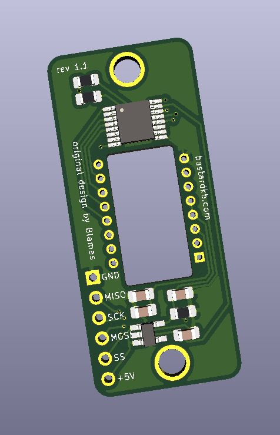

# PMW3360 sensor holder

- To be used with a PMW3360 sensor
- Uses 2.54mm spaced connectors for signals
- 2 holes for M3 screws

## BOM

See in Kicad

## License

This work is licensed under a Creative Commons Attribution-NonCommercial-ShareAlike 4.0 International License.
